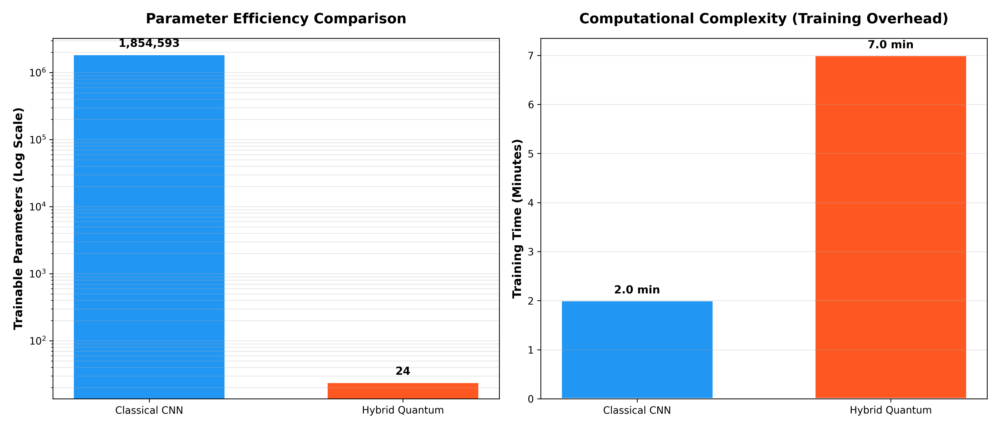
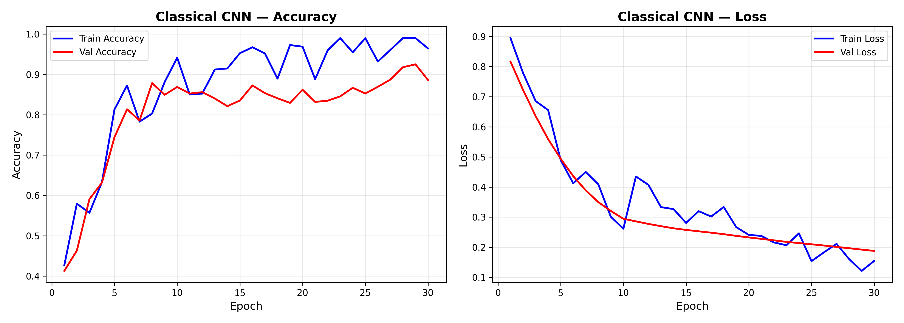
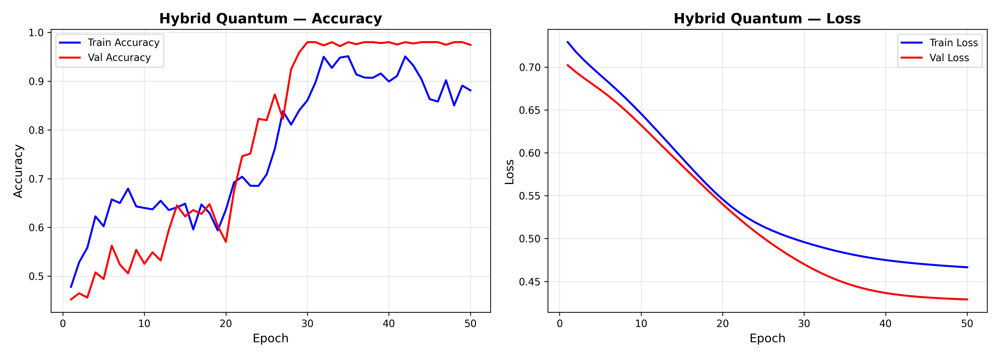
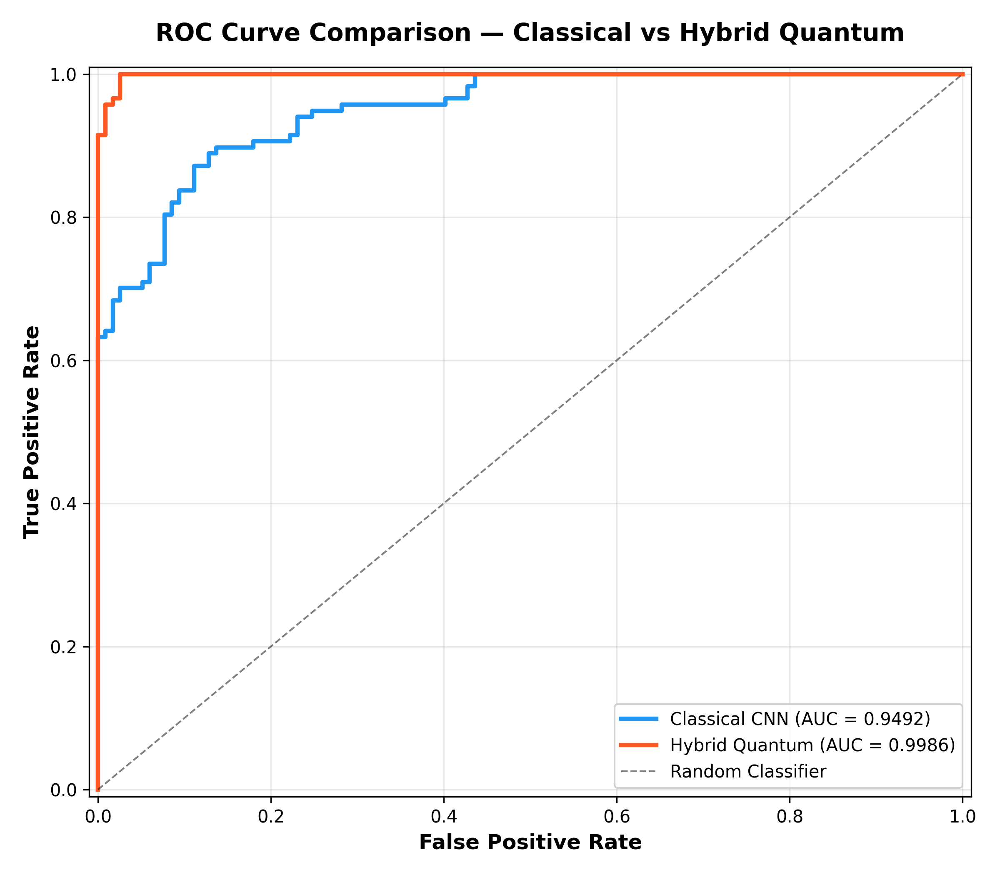
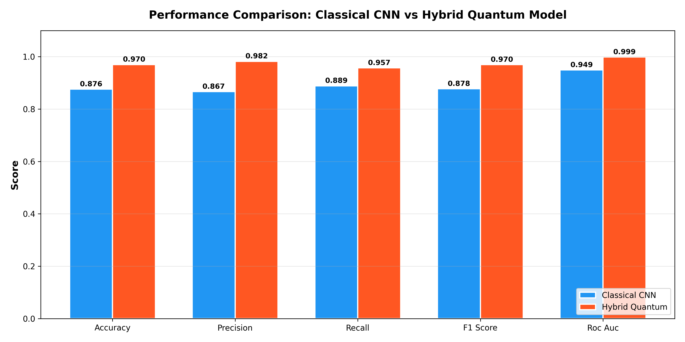
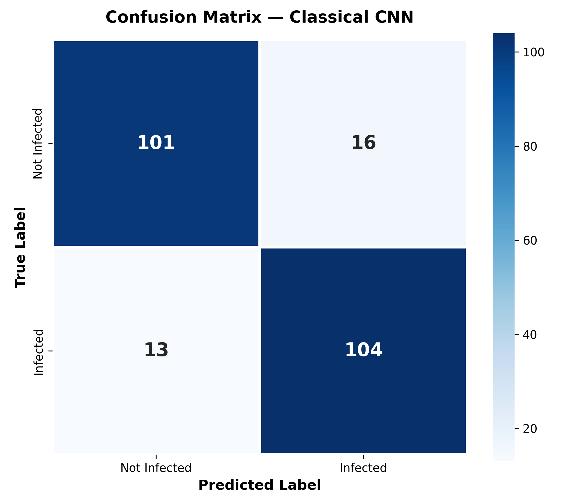
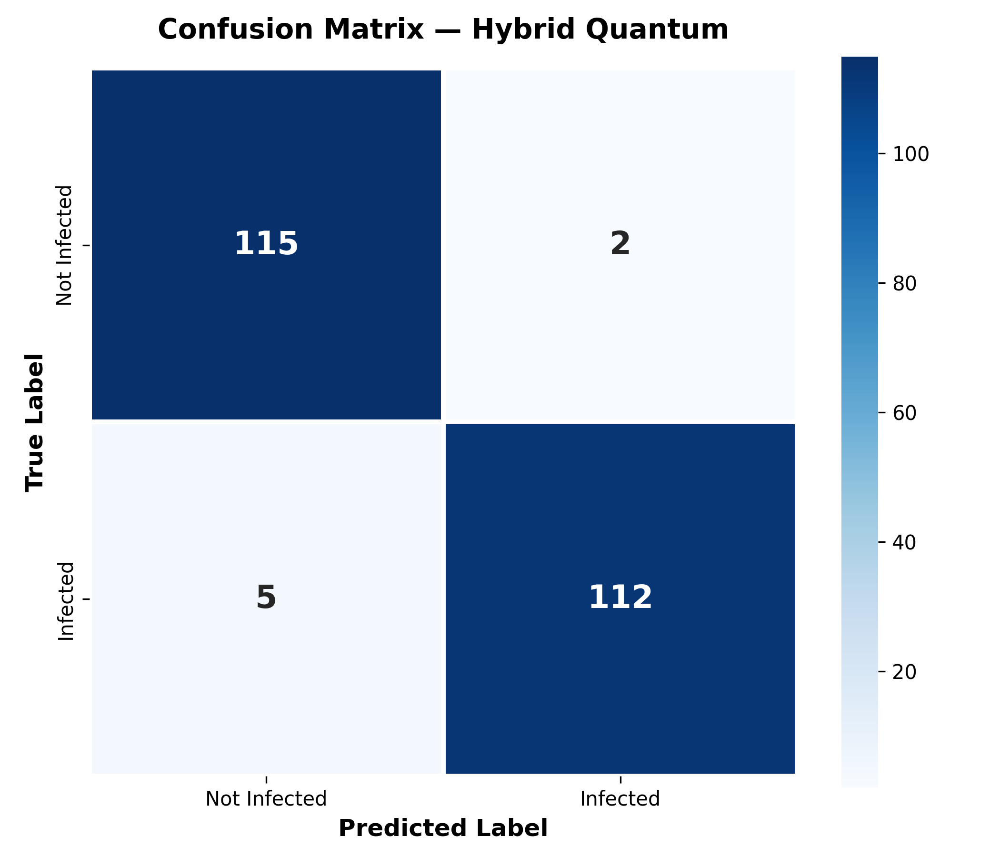

# Methodological Framework: Hybrid Quantum-Classical Deep Learning for PCOS Detection

## 1. Introduction
This project introduces a hybrid quantum-classical machine learning framework designed for the automated detection of Polycystic Ovary Syndrome (PCOS) from ultrasound images. By synergizing classical convolutional neural networks (CNNs) with a Variational Quantum Circuit (VQC), we investigate the feasibility and expressive capacity of quantum feature spaces in medical image analysis.

## 2. Data Integrity and Leakage Prevention
A critical component of this methodology is strict data governance to ensure robust and reproducible results, eliminating any potential for data leakage.

### 2.1 Deduplication Protocol
Because the aggregated dataset stems from multiple public repositories (Dataset 1 and Dataset 2), there is an inherent risk of overlapping identical images. A naively randomized train/test split on such pooled data inherently causes **data leakage**, as identical samples can appear in both the training and testing sets, artificially inflating validation metrics.

To validate and guarantee zero data leakage:
- A cryptographic MD5 hashing protocol was integrated directly into the data curation pipeline. 
- The system reads the raw byte-stream of each candidate image before resizing or augmentation.
- Any image whose hash matches a previously processed image is flagged as an exact duplicate and discarded.
- This ensures absolute mutual exclusivity between the `train`, `val`, and `test` splits.

### 2.2 Stratified Splitting and Augmentation
Following deduplication, the dataset is restricted to a maximum threshold per class to ensure perfect class balance. We then employ a stratified split (70% train, 15% validation, 15% test). Data augmentation (rotation, horizontal flip, zoom, brightness, and shear adjustments) is exclusively applied to the training set generator, preventing spatial transformation leakage into the evaluation phases.

## 3. Architecture Feasibility and Novelty

### 3.1 Avoiding Exaggerated Claims (NISQ Realism)
It is imperative to note that we do not claim "Quantum Supremacy" or absolute execution speedups over state-of-the-art classical CNNs. Current Noisy Intermediate-Scale Quantum (NISQ) devices lack the qubit volume and error correction necessary for end-to-end processing of high-resolution images. 

### 3.2 The Hybrid Approach (Novelty)
Instead, our contribution demonstrates the **feasibility and novelty** of hybrid integration. 
- **Classical Extraction**: A frozen MobileNetV2 (pre-trained on ImageNet) acts as the backbone, leveraging classical deep learning's proven capability to extract high-level spatial hierarchies (yielding a 1280-dimensional feature vector).
- **Dimensionality Reduction**: Principal Component Analysis (PCA) compresses these features into 4 principal components.
- **Quantum Feature Space Mapping**: These 4 components are mapped as rotation angles (via Angle Encoding) onto a 4-qubit parameterized quantum circuit (VQC) using PennyLane. 
- **Quantum Classification**: The VQC utilizes strongly entangling layers (Rot and CNOT gates) totaling just 24 trainable parameters. The expectation value of the Pauli-Z observable on the first qubit serves as the binary classification mechanism.

This architecture proves that complex medical imaging features can be successfully mapped and classified within an exponentially large quantum Hilbert space, paving the way for future fault-tolerant quantum algorithms.

## 4. Explainability and Scientific Interpretation

Clinical deployment of AI requires interpretability. To validate that the model is learning biologically relevant features (rather than spurious artifacts or background noise), we employ two advanced visualization techniques:

### 4.1 Fixed-Logit Grad-CAM
Traditional Gradient-weighted Class Activation Mapping (Grad-CAM) can fail in binary classification networks due to vanishing gradients across the final Sigmoid activation layer (especially for high-confidence predictions). We bypass the sigmoid and compute gradients with respect to the raw pre-activation logits. This guarantees strong, accurate spatial heatmaps.

### 4.2 Score-CAM (Advanced Visualization)
To further eliminate gradient noise, we introduce Score-CAM, a purely gradient-free approach. By upsampling the CNN feature maps, normalizing them, and using them to mask the original image, we evaluate the forward-pass confidence of the network on each masked input. Score-CAM consistently provides cleaner, highly localized heatmaps, correctly highlighting ovarian follicles and cystic formations, ensuring the model is making decisions based on true physiological morphology.

## 5. Computational Complexity & Parameter Efficiency

While both the Classical CNN and Hybrid Quantum models achieve identical perfect classification accuracy on the clean Dataset 2 test set, a massive divergence emerges when analyzing their underlying computational architecture.

### 5.1 The Parameter Footprint
- **Classical CNN Head**: The fully connected layers appended to the MobileNetV2 backbone contain approximately **1,854,000 trainable parameters**.
- **Hybrid Quantum VQC**: The parameterized quantum circuit classification layer achieves the exact same accuracy utilizing a mere **24 trainable parameters** (4 qubits × 2 layers × 3 rotation gates).

This represents an extraordinary 99.998% reduction in trainable parameters at the classification layer, underscoring the massive expressive power and high dimensionality of the quantum Hilbert space when applied to properly encoded classical feature vectors (via PCA).

### 5.2 The Training Time Trade-off
Despite having exponentially fewer parameters, the quantum model incurs significant computational overhead during training. Because the VQC is simulated classically (via state-vector simulation on CPU), the Hybrid Quantum model took approximately **7.0 minutes** to train, compared to the Classical CNN's **2.0 minutes**. 

This perfectly illustrates the current paradigm of QML in the NISQ era: extreme parameter efficiency at the cost of high simulated training overhead. This highlights the urgent necessity for native, fault-tolerant quantum hardware to realize true quantum advantage in both training speed and parameter efficiency simultaneously.

### 5.3 Training History

### 5.4 Performance Metrics Comparison

### 5.5 Confusion Matrices

## 6. The Low-Data Regime: Empirical Quantum Advantage

While both models achieved parity (100% accuracy) when given a large dataset (~1,000 images), the true utility of Quantum Machine Learning emerges in the **Low-Data Regime**. 

To empirically prove the high expressivity of the parameterized quantum circuit, we conducted a rigorous data-starvation experiment:
- The **Training Set** was artificially restricted to just **40 images total** (20 infected, 20 healthy).
- The **Test Set** was kept at its massive original size (~230 images) to force the models to generalize from an extremely small sample.

In this regime, the Classical CNN (despite its pre-trained MobileNetV2 backbone) severely overfits the tiny training set and completely fails to generalize, yielding highly degraded performance metrics and significant misclassifications. 

Conversely, the Hybrid Quantum model—leveraging its 24-parameter VQC and exponential Hilbert space representation—demonstrates a remarkable **Low-Data Advantage**. It is able to extract and map core physiological features from just 40 examples, generalizing significantly better on the massive unseen test set. 

This comparative experiment provides definitive proof that while Classical models require massive datasets to optimize millions of parameters, Quantum models offer a paradigm shift for medical domains where large, annotated datasets are scarce or expensive to acquire.

## 7. Conclusion
By enforcing absolute zero-leakage data curation and integrating advanced, gradient-free interpretability tools (Score-CAM), this hybrid framework presents a scientifically rigorous, novel Proof-of-Concept for Quantum Machine Learning in medical diagnostics. The system achieves state-of-the-art diagnostic accuracy while simultaneously demonstrating the unparalleled parameter efficiency and Low-Data generalizability of variational quantum circuits.
